# Automatización de Reporte TOA

Este proyecto integra y procesa información proveniente de múltiples fuentes (TOA, Autin, SITIOS, etc.) para generar un reporte consolidado y análisis detallado en Excel. La solución se implementa en Python y utiliza una base de datos SQLite para almacenar y actualizar los datos.

## 1. Descripción del proyecto

### Requisitos

- Python 3.7 o superior.
- Librerías: `pandas`, `numpy`, `sqlite3`, `openpyxl`, `os`, `time`, `traceback`.
- Acceso a OneDrive (o ruta similar) donde se encuentran los archivos de entrada y la base de datos.

### Estructura del Proyecto

- **main.py**: Archivo principal que orquesta el flujo completo del proceso.
- **funciones.py**: Contiene todas las funciones encargadas de procesar, consolidar y exportar la información.

### Descripción de las Funciones

#### Funciones en `funciones.py`

- **procesar_archivos_tickets(carpeta, tabla, conexion, id)**  
  Procesa los archivos Excel ubicados en la carpeta dada, combina la información en un DataFrame y actualiza la tabla correspondiente en la base de datos. Utiliza funciones auxiliares para obtener archivos nuevos, combinarlos y marcar los procesados.

- **obtener_archivos_excel(carpeta)**  
  Retorna una lista de archivos Excel de la carpeta que aún no han sido procesados, aplicando un orden basado en la fecha extraída del nombre del archivo. *(Nota: La lógica para asignar año funcionará hasta junio de 2025.)*

- **combinar_datos_archivos(carpeta, archivos)**  
  Combina la información de múltiples archivos Excel en un único DataFrame. Valida que cada archivo tenga las columnas requeridas y elimina duplicados basándose en identificadores como 'Nro TOA', 'Task Id' o 'Order ID'.

- **convertir_fechas(df, nombre_columna)**  
  Convierte los valores de una columna a un formato datetime unificado. Registra y muestra aquellos valores que no pudieron convertirse.  
  *Mejora sugerida: Refinar el mecanismo de captura de errores en la conversión de fechas.*

- **actualizar_tipos_datos(conexion, tabla, df)**  
  Actualiza los tipos de datos de cada columna del DataFrame según los metadatos almacenados en la base de datos. Si faltan metadatos, solicita al usuario ingresar el tipo de dato correcto.

- **actualizar_base_datos(conexion, tabla, df, id)**  
  Guarda el DataFrame en la tabla especificada de la base de datos. Si la tabla existe, concatena los datos nuevos y elimina duplicados; de lo contrario, crea una nueva tabla.

- **marcar_archivos_procesados(carpeta, archivos)**  
  Renombra y mueve los archivos Excel ya procesados a una subcarpeta `old`, agregando un sufijo con la fecha actual para evitar reprocesos.

- **combinar_datos_sitios(carpeta, tabla, conexion, id)**  
  Combina la información de varios archivos Excel (sitios, swap y TSS) en un único DataFrame y actualiza la base de datos. Realiza ajustes en nombres de columnas para asegurar la correcta unión.

- **actualizar_lista_tickets_test(conexion, tabla_tickets, tabla_tickets_test)**  
  Extrae tickets de prueba de la tabla principal y de un archivo Excel, solicita confirmación para tickets sin validar, y actualiza la tabla de tickets TEST tanto en la base de datos como en el archivo Excel.

- **actulizar_columnas(df)**  
  Renombra y filtra las columnas de un DataFrame basándose en un diccionario predefinido para estandarizar los nombres a lo largo del proyecto.

- **etiquetar_nro_toa_y_rango(df_merged, archivo_excel)**  
  Etiqueta los registros del DataFrame consolidado: marca aquellos que se encuentran en la columna `activityId` del archivo Excel y asigna una etiqueta de rango ("en_rango") según si la fecha de creación está dentro de un rango definido por `timeOfBooking`.

- **combinar_tablas(conexion, tabla_TOA, tabla_autin, tabla_sitios, tabla_final)**  
  Combina las tablas de TOA, Autin y Sitios en una tabla consolidada. Realiza múltiples uniones, ajustes de columnas, cálculos de tiempos y asignación de etiquetas antes de actualizar la base de datos.

- **ordenar_y_seleccionar_tickets(grupo, max_tickets)**  
  Ordena un grupo de tickets según una clave de prioridad (definida por el estado de la tarea y la fecha de creación) y selecciona los primeros `max_tickets`.

- **clasificar_tickets_autin(df_autin, conexion)**  
  Clasifica y prioriza los tickets provenientes de Autin, integrando información adicional de abastecimiento y PR. Agrupa, ordena y pivota el DataFrame para obtener un ticket por fila.

- **convertir_tabla_a_excel(tabla, archivo_salida, conexion, hoja_nombre='Sheet1')**  
  Convierte una tabla de la base de datos en un archivo Excel formateado, creando una tabla con estilos, aplicando formatos condicionales y añadiendo una columna con una fórmula (Semáforo) para análisis.

- **guardar_todas_las_tablas(conexion, archivo_salida)**  
  Exporta todas las tablas de la base de datos a un único archivo Excel, ubicando cada tabla en una hoja separada.

#### Función en `main.py`

- **procesar_datos()**  
  Función principal que orquesta el proceso completo. Define rutas, abre la conexión a la base de datos, procesa archivos de las diferentes fuentes, combina tablas, genera el reporte final en Excel y muestra estadísticas del proceso.

### Instrucciones de Uso

1. Configure las rutas y credenciales en `main.py` según su entorno.
2. Asegúrese de que la base de datos y los archivos de entrada estén en la ubicación correcta.
3. Ejecute el script principal:
   ```bash
   python main.py
4. Revise los archivos Excel generados (por ejemplo, ArchivoFinal.xlsx y Reporte.xlsx) y la salida en consola.

### Notas
- La lógica para determinar el año en obtener_archivos_excel funcionará correctamente hasta junio de 2025; luego deberá ajustarse.
- Se recomienda revisar y actualizar los formatos de fecha y manejo de errores en futuras mejoras.


---

## 2. Flujo Detallado del Proceso

A continuación se describe el flujo completo del proceso de forma secuencial:

1. **Inicialización y Configuración**  
   - Se definen las rutas base para archivos (TOA, Autin, Autin PR, SITIOS) y la ubicación de la base de datos SQLite.
   - Se especifican los nombres de las tablas que se usarán para almacenar los datos.

2. **Conexión a la Base de Datos**  
   - Se abre la conexión a la base de datos.
   - Se elimina la tabla consolidada existente para iniciar un proceso limpio.

3. **Procesamiento de Archivos de Entrada**  
   - **TOA:** Se invoca `procesar_archivos_tickets` para la carpeta de TOA, que:
     - Obtiene la lista de archivos Excel nuevos.
     - Combina sus datos en un DataFrame.
     - Actualiza la tabla `tickets_TOA` en la base de datos.
     - Marca los archivos procesados.
   - **Autin:** Se procesa la carpeta de Autin Tickets de forma similar, actualizando la tabla `tickets_autin`.
   - **Autin PR:** Se procesa la carpeta de Autin PR actualizando la tabla `tickets_pr`.
   - **SITIOS:** Se procesa la carpeta de SITIOS mediante `combinar_datos_sitios`, que integra información de archivos relacionados con sitios, swap y TSS.

4. **Consolidación de Datos**  
   - Se combinan las tablas `tickets_TOA`, `tickets_autin` y `info_sitios` a través de `combinar_tablas`:
     - Se actualizan y normalizan tipos de datos.
     - Se realizan uniones basadas en claves comunes (ej. `Codigo_Unico`).
     - Se asignan marcas especiales (por ejemplo, tickets test, empresa, marcha blanca, proactivo).
     - Se calculan diferencias en fechas (SWAP_dias, TSS_dias, Tiempo_TOA_Autin).
     - Se identifican tickets reiterados y se asignan etiquetas según reglas definidas.

5. **Exportación del Reporte**  
   - Se genera un reporte final consolidado en Excel mediante `convertir_tabla_a_excel`, el cual:
     - Aplica formatos condicionales y estilos.
     - Añade una columna "Semáforo" con una fórmula para análisis en tiempo real.
   - (Opcional) Se pueden guardar todas las tablas en un único Excel con hojas separadas usando `guardar_todas_las_tablas`.

6. **Finalización y Resumen**  
   - Se muestran en consola las tablas existentes en la base de datos y el número de registros en cada una.
   - Se imprime el tiempo total de ejecución.
   - Se cierra la conexión a la base de datos.

    <p align="center">
        
    </p>

---

## 3. Mejoras Recomendadas para el Proyecto

1. **Facilidad de Uso:**
   - Establecer una conexión con Azure para gatillar la ejecución del script desde Power Automate.
   - Crear un flujo en Power Automate que, mediante el envío de un correo electrónico, genere el informe a demanda.

2. **Automatización:**
   - Automatizar la descarga de archivos desde las distintas plataformas a intervalos regulares para integrar el flujo de datos de forma continua y sin intervención manual.

3. **Optimización de la Eficiencia del Código:**
   - Evaluar y mejorar la eficiencia del código para reducir los tiempos de ejecución.
   - Actualmente, al generar un nuevo informe se cruzan todos los tickets, lo que ralentiza el proceso.
   - Para mejorar el rendimiento, se recomienda evitar la actualización de casos cuyos datos no cambian, como los tickets cancelados y completados.

---

## 4. Archivos de Tutoriales

Dentro de la carpeta `usos` se encuentran los siguientes tutoriales:
- **Tutorial: Clonar el Repositorio**  
  Explica cómo clonar el repositorio de GitHub en una carpeta local para poder hacer uso del script.
  
- **Tutorial: Descarga Diaria de Información**  
  Detalla el proceso para configurar la descarga diaria de datos desde las distintas plataformas, garantizando la actualización del informe al menos una vez al día.

